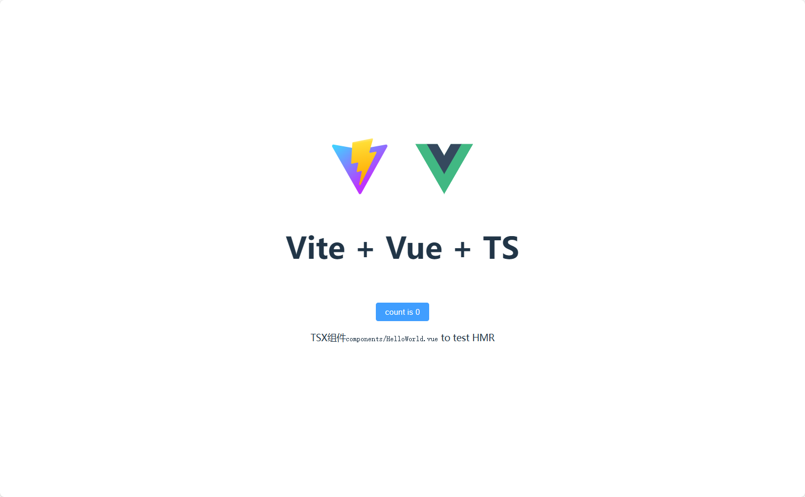

# Vue 3 + Vite + TS空模板



## 特性

- **🌟 最新技术栈**：使用 Vue3/Vite4 等前端前沿技术开发
- **🌟 TypeScript**: 应用程序级 JavaScript 的语言
- **🌟 TSX**: 开箱支持TSX语法
- **🌟 自动引入**: 自动按需引入组件, vue及生态插件API开箱即用
- **🌟 Eslint**: 统一规则执行代码检查, 发现潜在得代码错误
- **🌟 Prettier**: 格式化代码,规范统一代码风格
- **🌟 commitlint**: 规范git commit提交信息格,更清晰的查看每一次代码提交记录

## 安装使用

**克隆或下载源码**

> 环境 node版本 >= 16, 建议项目使用pnpm包管理器,

- 安装依赖

```bash
npm install pnpm -g
```

```bash
pnpm i
```

- 运行

```bash
# 运行主应用, 其他命令详见根目录package.json
pnpm dev
```

- 打包

```bash
# 打包主应用, 其他命令详见根目录package.json
pnpm build
```
